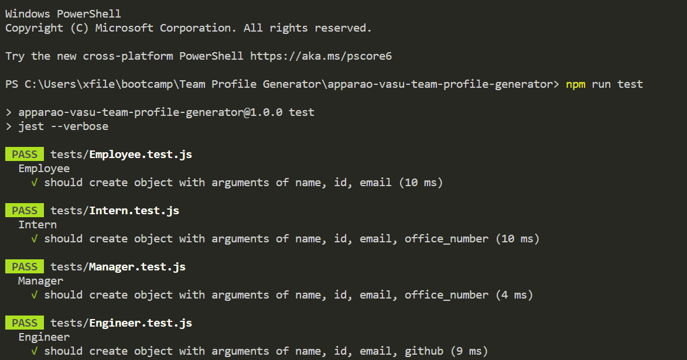
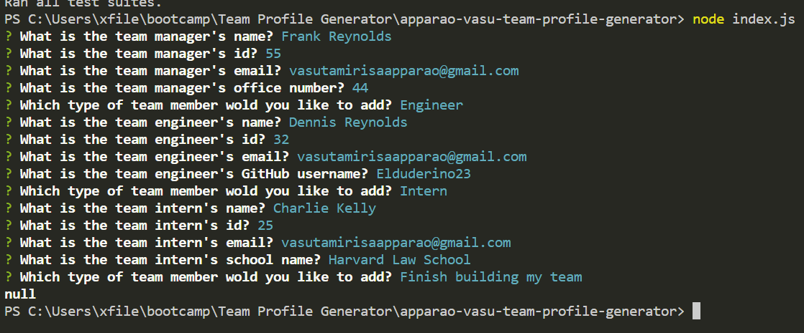
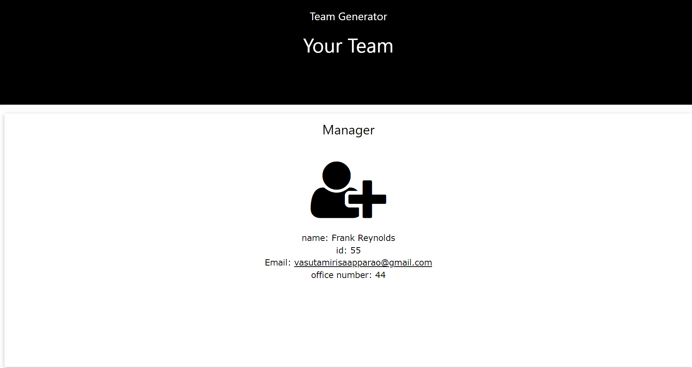

# Team Profile Generator

## Deployable Video Link
https://watch.screencastify.com/v/5dSwvtKhCM5jr8m2XtbE

## Goal
The task was to make a HTML generator that created a website with sections for Manager, Intern, and Engineer. All three positions had to to have the inputs for names, id numbers and emails addresses that when clicked in the HTML, opens up and populate the TO field of the email with the address in the user's default email program. The only difference between each rolls was the Manager roll had to have an office number, the Engineer roll had to have a GitHub username that when clicked on sent the user to the engineer's GitHub profile, and the Intern roll had to have an input to put the name of the school the user wants to input in. The application also needed to have test.js files that associated with each roll, Engineer.test.js to Engineer.js for example, and all tests had to pass.

## Technology Use
  - Javascript
  - HTML
  - W3.CSS Templates
  - JQuery
  - Node.js
  - Inquirer
  - Jest
  - VS Code
  - Git Bash 
  - GitHub

## Execution
The first part of making the team profile generator was to make a setup html file. There was an early decision to create a style.css and index.html early on in order to create the structure in order to make the right format for the index.js but after implementing the W3.CSS templates for the project and it working, the decision was made to cut the style.css for the file was unnecessary. Then came the hardest part of the profile generator, writing code for Employee.test.js and Employee.js. A lot of research and testing was done in order to pass the npm run test tests but eventually the following codes was written which is seen below

Employee.test.js code:
```Javascript
const Employee = require("../Employee")
describe("Employee", () => {
    it("should create object with arguments of name, id, email",  () => {
        const drone = new Employee("tom", 1, "tomselleck@gmail.com")
        expect(drone.name).toEqual("tom")
        expect(drone.id).toEqual(1)
        expect(drone.email).toEqual("tomselleck@gmail.com")
        expect(drone.getRole()).toEqual("Employee")
    });

})

```

Employee.js code:

```Javascript
 class Employee{
    constructor(name, id, email){
    this.name = name,
    this.id = id,
    this.email = email
    }
    getName = () => {
        return this.name;
    }
    getID = () => {
        return this.id;
    }
    getEmail = () => {
        return this.email;
    }
    getRole = () => {
        return "Employee";
    }
}
  
  module.exports = Employee;
```
The require method in Employee.test.js shown above the pulls from Employee.js in order to test name, id, email, and the get roll of Employee with place holder name of Tom Selleck. After passing the test for Employee.js using Employee.test.js, making the other files was simpler because it was the same set up but adding their respective attribute. For example, after linking Manager.js with Employee.js, The only get method that was needed was office number. Since Manager.js, Intern.js, and Engineer.js are connect to Employee.js through the extend method and require method, all the javascript files for each roles need just the get method for their individual attribute.
An example of Intern, seen below illustrates this point:
```Javascript
const Employee =require("./Employee")
class Intern extends Employee{
    constructor(name, id, email, school){
        super(name, id, email)
    this.school = school
    }
    getSchool = () => {
        return this.school;
    }
    getRole = () => {
        return "Intern";
    }
}
  
  module.exports = Intern;
```

The second part of tackling the team generator after passing the individual role tests using npm run test was coding the index.js. This part required three parts, generating the html file with inputs from the user, an array of questions for the user to answer, and prompts for the user to answer the questions themselves. The first part used require methods for the npm inquirer, fs or file system for short, and all the job roles shown below:
```Javascript
const inquirer = require('inquirer')
const fs = require("fs")
const Manager = require("./Manager.js")
const Engineer = require("./Engineer.js")
const Intern = require("./Intern.js")
const Employee = require("./Employee.js")
```
After setting up the beginning part, The creation of the array with questions for the user to answer nd the set up of each answered prompt with the right rolls within the right spots of the html had to be created using functions like generateHTML and const variables for each questions set for each roll and choice box as well as inquirer prompts. After making the prompts with questions and a generateHTML for the generated html file, a function, called userChoice, was created for switch statements for each question.
The set up in it's entirety is shown below:

```Javascript
const employeeArray = []

const managerQuestion = [{
    name: "name",
    message: "What is the team manager's name?",
    type: "input",

}, {
    name: "id",
    message: "What is the team manager's id?",
    type: "input",

}, {
    name: "email",
    message: "What is the team manager's email?",
    type: "input",

}, {
    name: "office_number",
    message: "What is the team manager's office number?",
    type: "input",

}, {
    name: "roleChoice",
    message: "Which type of team member wold you like to add?",
    type: "list",
    choices: ['Engineer', 'Intern', 'Manager', 'Finish building my team']

}]

const engineerQuestion = [{
    name: "name",
    message: "What is the team engineer's name?",
    type: "input",

}, {
    name: "id",
    message: "What is the team engineer's id?",
    type: "input",

}, {
    name: "email",
    message: "What is the team engineer's email?",
    type: "input",

}, {
    name: "github",
    message: "What is the team engineer's GitHub username?",
    type: "input",

}, {
    name: "roleChoice",
    message: "Which type of team member wold you like to add?",
    type: "list",
    choices: ['Engineer', 'Intern', 'Manager', 'Finish building my team']

}]

const internQuestion = [{
    name: "name",
    message: "What is the team intern's name?",
    type: "input",

}, {
    name: "id",
    message: "What is the team intern's id?",
    type: "input",

}, {
    name: "email",
    message: "What is the team intern's email?",
    type: "input",

}, {
    name: "school",
    message: "What is the team intern's school name?",
    type: "input",

}, {
    name: "roleChoice",
    message: "Which type of team member wold you like to add?",
    type: "list",
    choices: ['Engineer', 'Intern', 'Manager', 'Finish building my team']

}]

// Generates HTML and places input information in the right spot
function generateHTML() {
    var htmlBeginner = `
    <!DOCTYPE html>
<html>
<head>
<title>Team Generator</title>
<meta charset="UTF-8">
<meta name="viewport" content="width=device-width, initial-scale=1">
<link rel="stylesheet" href="https://www.w3schools.com/w3css/4/w3.css">
<link rel="stylesheet" href="https://www.w3schools.com/lib/w3-theme-black.css">
<link rel="stylesheet" href="https://cdnjs.cloudflare.com/ajax/libs/font-awesome/4.3.0/css/font-awesome.min.css">
</head>
<body>

<!-- Header -->
<header class="w3-container w3-theme w3-padding" id="myHeader">
  <div class="w3-center">
  <h4>Team Generator</h4>
  <h1>Your Team</h1>
    <div class="w3-padding-32">
    </div>
  </div>
</header>
    `
    for (let i = 0; i < employeeArray.length; i++) {
        const element = employeeArray[i];

        if (element.getRole() === "Manager") {
            htmlBeginner +=
            `
            <div class="w3-row-padding w3-center w3-margin-top">
            <div class="w3-fifth">
  <div class="w3-card w3-container" style="min-height:460px">
  <h3>Manager</h3><br>
  <i class="fa fa-user-plus w3-margin-bottom w3-text-theme" style="font-size:120px"></i>
  <div>
  <div>name: ${element.name}</div>
  <div>id: ${element.id}</div>
  <div>Email: <a href ="mailto:${element.email}">${element.email}</a></div>
    <div>office number: ${element.office_number}</div>
   </div>
  </div>
</div>
</div>
</div>
    `
        } else if (element.getRole() === "Engineer") {
            htmlBeginner +=
            `
            <div class="w3-row-padding w3-center w3-margin-top">
            <div class="w3-fifth">
  <div class="w3-card w3-container" style="min-height:460px">
  <h3>Engineer</h3><br>
  <i class="fa fa-wrench w3-margin-bottom w3-text-theme" style="font-size:120px"></i>
  <div>
  <div>name: ${element.name}</div>
  <div>id: ${element.id}</div>
  <div><a href ="mailto:${element.email}">${element.email}</a></div>
    <div>Github: <a href ="https://github.com/${element.github}"target="_blank">${element.github}</a></div>
   </div>
  </div>
</div>
    `
        } else if (element.getRole() === "Employee") {
            htmlBeginner +=
            `
            <div class="w3-row-padding w3-center w3-margin-top">
    <div class="w3-row-padding w3-center w3-margin-top">
<div class="w3-fifth">
  <div class="w3-card w3-container" style="min-height:460px">
  <h3>Employee</h3><br>
  <i class="fa fa-user w3-margin-bottom w3-text-theme" style="font-size:120px"></i>
 <div>
  <div>name: ${element.name}</div>
  <div>id: ${element.id}</div>
  <div><a href ="mailto:${element.email}">${element.email}</a></div>
 </div>
  </div>
</div>
    `
        } else if (element.getRole() === "Intern") {
            htmlBeginner +=
            `
            <div class="w3-row-padding w3-center w3-margin-top">
            <div class="w3-fifth">
  <div class="w3-card w3-container" style="min-height:460px">
  <h3>Intern</h3><br>
  <i class="fa fa-child w3-margin-bottom w3-text-theme" style="font-size:120px"></i>
  <div>
  <div>name: ${element.name}</div>
  <div>id: ${element.id}</div>
  <div>email: <a href ="mailto:${element.email}">${element.email}</a></div>
    <div>school: ${element.school}</div>
   </div>
  </div>
</div>
     `
        }

    }
    htmlBeginner +=
    `
    </div>
</div>
<br>

<!-- Footer -->
<footer class="w3-container w3-theme-dark w3-padding-16">
    <h3>Footer</h3>
    <div style="position:relative;bottom:55px;" class="w3-tooltip w3-right">
      <span class="w3-text w3-theme-light w3-padding">Go To Top</span>    
      <a class="w3-text-white" href="#myHeader"><span class="w3-xlarge">
      <i class="fa fa-chevron-circle-up"></i></span></a>
    </div>
</footer>
    `
    return htmlBeginner
}
// Controls switching from one role to another.
function userChoice(nextRole) {
    switch (nextRole) {
        case ("Employee"):
            employee()
            break;
        case ("Engineer"):
            engineer()
            break;
        case ("Intern"):
            intern()
            break;
        case ("Manager"):
            manager()
            break;
        default:
            var makeHTML = generateHTML()
            fs.writeFile("Sample.html", makeHTML, error =>{
                console.log(error)
            });
            break;
    }
}
```
The last part of the index.js file is a series of functions that records the data saved from the user's inputs and which would be called in the generateHTML function. 

All the recorder functions for each job roll is shown below:

```Javascript

function manager() {
    inquirer.prompt(managerQuestion).then(function (data) {
        var newManager = new Manager(data.name, data.id, data.email, data.office_number)
        employeeArray.push(newManager)
        userChoice(data.roleChoice)
    })
}
function engineer() {
    inquirer.prompt(engineerQuestion).then(function (data) {
        var newEngineer = new Engineer(data.name, data.id, data.email, data.github)
        employeeArray.push(newEngineer)
        userChoice(data.roleChoice)
    })
}
function intern() {
    inquirer.prompt(internQuestion).then(function (data) {
        var newIntern = new Intern(data.name, data.id, data.email, data.school)
        employeeArray.push(newIntern)
        userChoice(data.roleChoice)
    })
}
function employee() {
    inquirer.prompt(employeeQuestion).then(function (data) {
        var newEmployee = new Employee(data.name, data.id, data.email)
        employeeArray.push(newEmployee)
        userChoice(data.roleChoice)
    })
}
 ```
## Result

The following website demonstrates what the final product looks like:

The test with every roll.js file pass the test.


The question prompts in terminal:


The generated website look:
